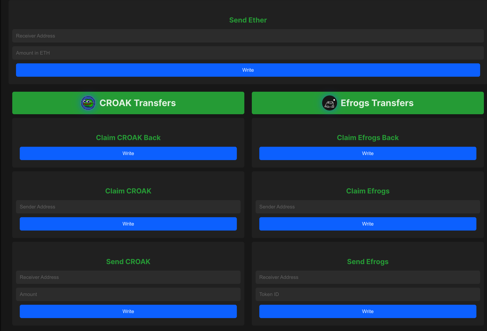

# SafeSend DApp

- **Author**: Harsh Agrawal & Venky Kumar

- **`GitHub`**: [harshagrawal2503](https://github.com/harshagrawal2503)
- **`GitHub`**: [BoddepallyVenkatesh06](https://github.com/BoddepallyVenkatesh06)

## Description:

The SafeSend contract facilitates secure and authenticated transfers of Ether, Efrogs NFTs, and $CROAK Meme Tokens between parties. It integrates additional authentication measures to prevent the loss of funds due to mistyped wallet addresses.

Features:
- Secure transfer of Ether with claim and reclaim functionalities.
- Secure transfer of Efrogs NFTs with claim and reclaim functionalities.
- Secure transfer of $CROAK tokens with claim and reclaim functionalities.

Progress:
In June, I dedicated significant effort to developing the SafeSend DApp. During this period:
- Built the User Interface (UI) to interact with the smart contract.
- Conducted extensive research on security best practices.
- Secured the smart contract by integrating robust methods from the OpenZeppelin library.

Smart Contract Deployment:
- The smart contract is deployed on the Sepolia Linea network.
- Contract address: [0x8c2af51e53238532ef3024a2981baab24cf5e50e](https://sepolia.lineascan.build/address/0x8c2af51e53238532ef3024a2981baab24cf5e50e#code)

Live Demo:
- Test the application at: [Live Demo](https://safesend-dapp.netlify.app/v)

Technologies and Tools Used:
- **Remix IDE:** Used for developing and deploying the smart contract.
- **OpenZeppelin:** Utilized for securing the smart contract with standard libraries.
- **React:** A JavaScript library for building user interfaces.
- **JavaScript:** The primary programming language for front-end development.
- **thirdweb SDK:** Simplifies wallet connection and contract interaction.
- **ethers.js:** A library for interacting with the Ethereum blockchain.
- **walletconnect:** Enables connecting mobile wallets to the DApp.
- **Next.js:** A React framework for server-side rendering and generating static websites.

How to Use:
1. Send Ether, NFT, or Tokens: Initiate a transfer using the respective send function.
2. Claim: The designated receiver can claim the transfer using the respective claim function.
3. Claim Back: The sender can reclaim the transfer if it has not been claimed by the receiver.

Security Measures:
- Utilizes OpenZeppelin's ReentrancyGuard to protect against reentrancy attacks.
- Implements comprehensive modifiers to ensure that only the designated sender or receiver can claim or reclaim the transfers.
- Ensures that each transfer must be claimed or reclaimed before a new transfer can be initiated by the same sender.

Getting Started:
1. Clone the repository: `git clone https://github.com/BoddepallyVenkatesh06/SafeSend-DApp.git`
2. Install dependencies: `npm install`
3. Navigate 'cd Front-End-UI\simple-dapp-v2'
4. Start the development server: `npm run dev`

## ScreenShot

## Contact:
- For any inquiries or support, please contact me.

## License:
- Open Source